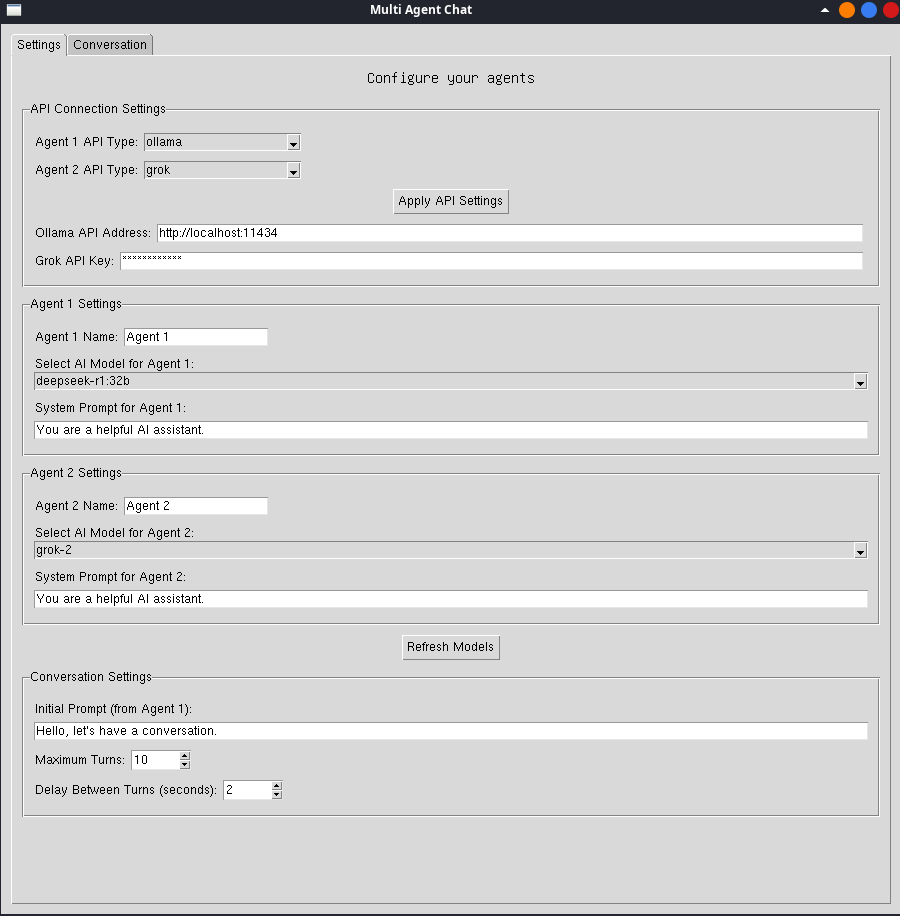
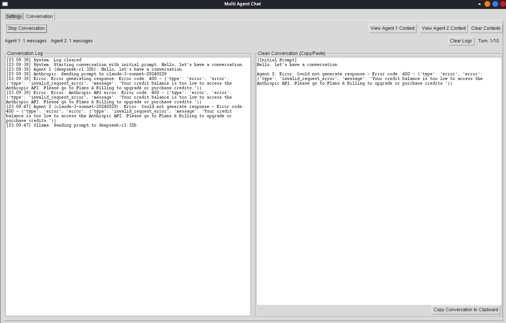

# Multi Agent Chat

A GUI application that allows two AI models to have a conversation with each other, supporting Ollama, OpenAI, and Anthropic APIs.

## Features

- Support for multiple AI providers:
  - Ollama (local or remote instances)
  - OpenAI (GPT-3.5, GPT-4)
  - Anthropic (Claude models)
  - Grok (Twitter/X's AI model)
  - Google Gemini (Pro and Flash models)
- Mix and match different AI providers for each agent
- Watch AI agents converse with each other
- Configure conversation parameters (initial prompt, number of turns, delay)
- Customize agent names for better readability
- Real-time message logging with a clean copy/paste conversation view
- View and manage conversation context for both agents

## Screenshoots





## Prerequisites

- Python 3.x
- For Ollama: Ollama installed and running (`ollama serve`)
- For OpenAI: Valid OpenAI API key
- For Anthropic: Valid Anthropic API key
- For Grok: Valid Grok API key
- For Gemini: Valid Google AI Studio API key
- Required Python packages (see requirements.txt)

## Installation

1. Clone this repository:
```bash
git clone https://github.com/yourusername/multi-agent-chat
cd multi-agent-chat
```

2. Install required packages:
```bash
pip install -r requirements.txt
```

3. Set up environment variables:
```bash
cp .env.example .env
```
Then edit the `.env` file to add your API keys and configure default settings.

4. If using Ollama, ensure it's running:
```bash
ollama serve
```

## Usage

1. Start the application:
```bash
python main.py
```

2. Configure API settings and select models for both agents:
   - Choose API type (Ollama, OpenAI, or Anthropic)
   - Enter API keys or Ollama address as needed
   - Select models for each agent
3. Configure the conversation parameters:
   - Initial prompt to start the conversation
   - Maximum number of conversation turns
   - Delay between turns
4. Click "Start Conversation" to begin
5. Watch as the two AI agents converse with each other

## Environment Variables

The application supports the following environment variables in the `.env` file:

- `OLLAMA_ADDRESS`: The address of your Ollama API (default: http://localhost:11434)
- `OPENAI_API_KEY`: Your OpenAI API key
- `ANTHROPIC_API_KEY`: Your Anthropic API key
- `GROK_API_KEY`: Your Grok API key
- `GEMINI_API_KEY`: Your Google Gemini API key
- `DEFAULT_API_TYPE1`: Default API type for Agent 1 (ollama, openai, anthropic, grok, or gemini)
- `DEFAULT_API_TYPE2`: Default API type for Agent 2 (ollama, openai, anthropic, grok, or gemini)

## Notes

- The application maintains conversation history for context-aware responses
- Each agent has its own conversation context that can be viewed separately
- The conversation will automatically stop after the specified number of turns

## License

This project is licensed under the GNU General Public License v3.0 - see the LICENSE file for details.

